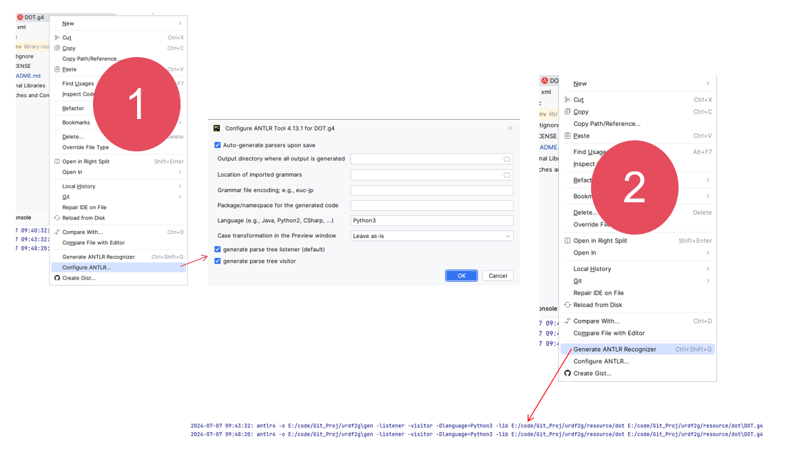

# urdf2g

 

parser Unified Robot Description Format with Antlr

最近参加了一个公司的ROS培训，看到了 check_urdf 和 urdf_to_graphiz 这两个命令，一瞬间就想到了 Antlr 解析。找了下 ROS 库里的源码——[urdfdom](https://github.com/ros/urdfdom)，看到里面用到是 CPP 写的，闲着没事用 Antlr 实现下，巩固下学到的 Antlr。

## Install and Dependencies

### Install
1. 如果使用 Pycharm 可以安装插件： `ANTLR V4-Tool`, 通过这个插件进行解析

2. 如果想使用命令行语句，则需要安装 Java 环境以及下载 [antlr4.jar](https://www.antlr.org/download.html) 包
``` bash
#!/bin/bash
set -o errexit

LOCATION=antlr-4.13.0-complete.jar
# -Xexact-output-dir for issue(https://github.com/antlr/antlr4/issues/638 and https://github.com/antlr/antlr4/pull/2065)
java -jar $LOCATION -Dlanguage=Cpp -listener -visitor -Xexact-output-dir -o gen/dot/ resource/dot/DOT.g4
```

### Dependencies
解析完语法文件，在编写以及运行代码时，需要依赖 ANTLR4 运行时环境（具体可查看[文档](https://github.com/antlr/antlr4/blob/master/doc/python-target.md)）：
``` bash
pip install antlr4-python3-runtime==4.13.0
```
